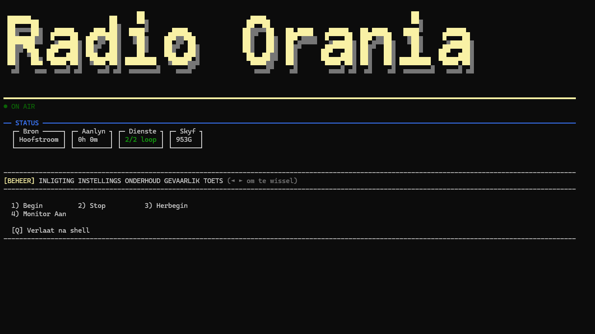

# Radio Orania Sender Installer

'n Debian-installer vir 'n radiosender: speel 'n internetstroom, skakel outomaties na noodmusiek by wegval.



---

## Kenmerke

* Internetstroom-afspeling, met opsionele rugsteun-stroom voor noodmusiek
* Outomatiese failover (ook by stilte/"dooie lug", nie net ontkoppeling) en terugskakeling
* Klankvlak-egalisering en begrensde skok-buffer teen FM-vertraging
* ALSA-klankuitset, Systemd-diens as toegewyde onbevoorregte gebruiker
* File Browser vir media, heartbeat-ondersteuning
* `radioctl` CLI en opsionele beheerpaneel-skerm
* Debian 13, eenvoudige installasie

---

## Hoe dit Werk

```text
              Hoofstroom  →  Rugsteun-stroom  →  Musiek + Sweepers
             (opsioneel af/stil)  (opsioneel af/stil)
                           │
                           ▼
                 Skok-buffer (begrens vertraging)
                           │
                           ▼
                      Liquidsoap
                           │
                           ▼
              Klankvlak-egalisering (normalize)
                           │
                           ▼
                        ALSA
                           │
                           ▼
                       Klankkaart
                           │
                           ▼
                     FM Sender
```

Elke bron word deurlopend vir stilte gemonitor — "dooie lug" (bv. 'n koderfout) veroorsaak dieselfde outomatiese oorskakeling as 'n regte ontkoppeling. `radioctl status` en die beheerpaneel-skerm wys watter bron werklik op-lug is.

### Waarom FM-vertraging oor tyd kan opbou

Netwerkstroom en klankkaart loop nie op dieselfde klok nie — 'n klein verskil bou oor ure/dae op tot 'n merkbare FM-vertraging (herbegin stel dit weer op nul). 'n Begrensde skok-buffer ("Maksimum stroom-buffer", instelbaar via Instellings of `radioctl set STREAM_BUFFER_MAX <sekondes>`) laat Liquidsoap outomaties 'n bietjie oudio val sodra die maksimum oorskry word, i.p.v. onbeperk op te bou.

---

## Vereistes

* Debian 13 (installer waarsku, blokkeer nie noodwendig, op ander weergawes)
* Internetverbinding
* ALSA-versoenbare klankkaart
* Root-toegang

---

## Installasie

```bash
git clone https://github.com/Schalk-Christiaan/Radio-Sender-Installer.git
cd Radio-Sender-Installer
sudo bash install.sh
```

Verbose modus (volledige uitset per stap; `installer.log` kry dit in elk geval altyd):

```bash
sudo bash install.sh --verbose
```

Die installer word na `/opt/radio-orania/installer` gekopieer sodat `radioctl reconfigure`/`update` later sonder die oorspronklike kloon werk.

---

## Sekuriteit

* Radio-, File Browser- en heartbeat-dienste loop as toegewyde, onbevoorregte gebruiker (`radio-orania`), nie root nie
* Gebruikersinvoer word gevalideer en veilig ge-kwoteer voor dit na konfigurasie-/stelsel-lêers geskryf word
* `environment.conf` en File Browser se `credentials.txt` is `chmod 600`

---

## Media Struktuur

```text
/opt/radio-orania/media
├── Musiek
└── Sweepers
```

---

## File Browser

Indien geaktiveer, bestuur media deur File Browser. URL/gebruiker/wagwoord in `/opt/radio-orania/filebrowser/credentials.txt`. 'n Herkonfigurasie skep nie 'n nuwe wagwoord of oorskryf bestaande gebruikers nie — die databasis word net by eerste installasie geskep.

---

## `radioctl` Beheerpaneel

```text
radioctl dash                 Bring die beheerpaneel-skerm terug
radioctl status               Status van al die dienste, sender naam, stroom URL
radioctl start/stop/restart   Begin / stop / herbegin die radio-diens
radioctl logs [-f]            Onlangse logs (-f om te volg)
radioctl test-stream          Toets of die stroom URL bereikbaar is
radioctl media                File Browser toegangsbesonderhede
radioctl backup               Rugsteun van die mediavouer
radioctl monitor-url          Netwerk-URL om die op-lug mengsel te monitor
radioctl bufferstat           Regstreekse netwerk-buffer van die aktiewe bron
radioctl datausage            Data-verbruik vandag/maand (vnstat)
radioctl sysstats             CPU-las, geheue, skyfspasie, CPU-temperatuur
radioctl set <S> <W>          Verander 'n instelling (STREAM_URL, BACKUP_STREAM_URL,
                              MUSIC_WEIGHT, SWEEPER_WEIGHT, ALSA_DEVICE, STATION_NAME,
                              HEARTBEAT_URL, STREAM_BUFFER_MAX)
radioctl passwords            Al die gestoorde wagwoorde
radioctl reconfigure          Loop die opstelling-assistent weer
radioctl update               Trek jongste weergawe en herinstalleer
radioctl uninstall            Verwyder die hele installasie

Foutsimulasie (sien "Toets-oortjie" hieronder):
radioctl test-source-status/-stop/-start <1|2>
radioctl test-internet-status/-block/-restore
radioctl test-service-crash
radioctl test-heartbeat
radioctl test-soundcard
```

Vereis root (`sudo radioctl ...`): start, stop, restart, backup, set, passwords, reconfigure, update, uninstall, en die toets-opdragte wat werklik iets verander (test-source-stop/-start, test-internet-block/-restore, test-service-crash, test-soundcard).

---

## Beheerpaneel-skerm

Opsioneel: 'n volskerm, outomaties-vernuwende beheerpaneel wat verskyn by aanmelding (SSH of fisies op tty1). Loop as beperkte `radio-admin`-gebruiker met net `sudo`-toegang tot `radioctl`. Wagwoord eenmalig gewys tydens installasie, gestoor in `/opt/radio-orania/config/radio-admin-credentials.txt`.

STATUS (aktiewe bron, aanlyn-tyd, dienste, skyfspasie) bly altyd sigbaar. Daaronder wissel `◄`/`►` tussen ses oortjies; `[Q]` verlaat altyd na 'n gewone shell.

### Volskerm op die fisiese skerm

Die installer stel outomaties 'n kleiner konsole-lettertipe (Terminus 12x6) op tty1 sodat meer inhoud pas. Indien die skerm nog nie die volle breedte gebruik nie, stel die resolusie via GRUB:

```bash
sudo nano /etc/default/grub
# GRUB_CMDLINE_LINUX_DEFAULT="video=1920x1080@60"
sudo update-grub
sudo reboot
```

Lettertipe self verstel: `sudo dpkg-reconfigure console-setup`.

### Monitor

BEHEER se "Monitor Aan" speel plaaslik (via `mpv`) presies wat op-lug gaan, met 'n regstreekse klankvlak-balk. Weer kies ("Monitor Af") om te stop — apart van "Stop", wat die werklike uitsending stop. (`radioctl monitor-url` gee die netwerk-URL vir elders, bv. 'n blaaiser.)

### Oortjies

Genommer per oortjie, herbegin by 1 — tik die nommer, druk Enter (sien `docs/adr/0001-dashboard-single-screen-tab-navigation.md` vir ontwerp-agtergrond):

* **BEHEER** (verstek) — Begin, Stop, Herbegin, Monitor aan/af
* **INLIGTING** — stelsel-syfers (buffer, data, CPU, geheue, temperatuur), Logs, Media
* **INSTELLINGS** — stroom URL's, stasienaam, ALSA-toestel, musiek/sweeper-verhouding, Heartbeat URL, stroom-buffer
* **ONDERHOUD** — Rugsteun, sagteware-opdatering, herkonfigurasie, kleurskema
* **GEVAARLIK** — wagwoorde wys, alles verwyder
* **TOETS** — foutsimulasie (sien hieronder)

Elke INSTELLINGS-wysiging pas dadelik toe en herbegin die diens waar nodig; dieselfde sleutels is ook direk via `radioctl set <SLEUTEL> <WAARDE>` verstelbaar.

### Toets-oortjie

Elke toets is omkeerbaar en raak nooit meer as nodig nie:

* **Bron 1/2: Simuleer wegval** — stop/begin die stroom se Liquidsoap-inset; forseer regte failover, plaaslik en omkeerbaar
* **Internet: Simuleer verlies** — blokkeer nuwe uitgaande verkeer (`iptables`), laat bestaande koppelinge deur; outo-herstel na 60s
* **Diens-crash toets** — SIGKILL die diens om `Restart=always` te toets (Y/N-bevestiging, veroorsaak regte onderbreking)
* **Heartbeat-toets** — een oproep na `HEARTBEAT_URL`, wys slaag/faal
* **Klankkaart-toets** — kort toon na die ALSA-toestel

---

## Logs

* Installer: `installer.log`
* Radio-diens: `journalctl -u radio-orania -f`
* File Browser: `/opt/radio-orania/filebrowser/filebrowser.log`

---

## Verwydering

```bash
sudo bash uninstall.sh
```

Bied eers aan om media na `.tar.gz` te rugsteun. Verwyder Radio Orania-, File Browser- en heartbeat-dienste, outo-restart timer, `radioctl`/beheerpaneel-skerm, die `radio-admin`- en `radio-orania`-gebruikers, en alle data.

---

## Projek Status

### V1.0 — Voltooi

Installer, Liquidsoap-integrasie, outomatiese failover/herstel, File Browser, heartbeat, validasie, uninstaller, onbevoorregte diens-gebruiker, `radioctl`, beheerpaneel-skerm, ShellCheck CI.

### Beplan vir V1.1

Verdere hardening, service watchdog, File Browser wagwoord-reset.

---
